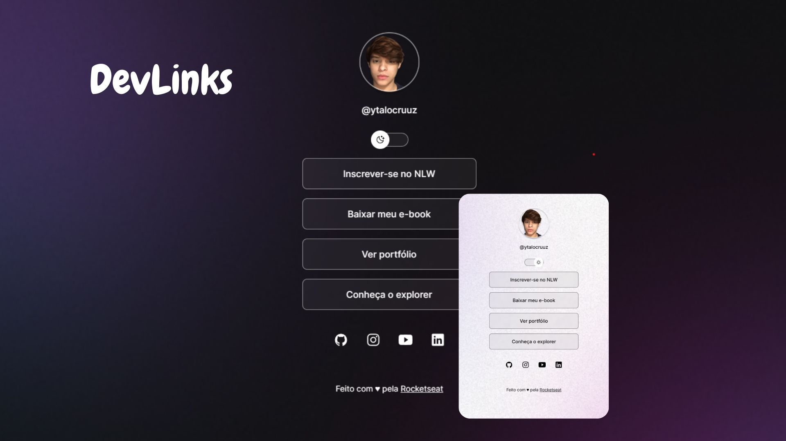

# DevLinks

 Evento exclusivo e gratuito, promovido pela rocketseat para ensino de tecnologias WEB
 

🚀 Tecnologias

Esse projeto foi desenvolvido com as seguintes tecnologias: 

- HTML e CSS
- JavaScript
- git e GitHub

💻 Projeto

O DevLinks é um agragador de links para usar com cartão de visitas online. 

📝 Licença
Esse projeto está sob a licença MIT.

Feito com ♥ by Rocketsea